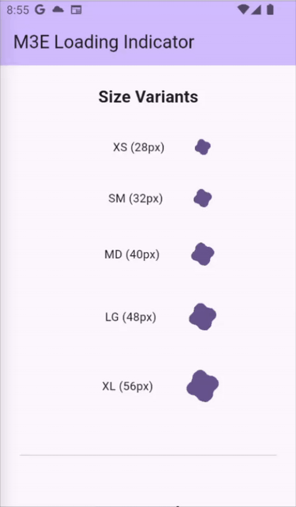

# M3E Loading

A Flutter package providing Material 3 Expressive loading indicators with smooth morphing shape animations.

<div align="center">
  
</div>

## Features

- 🎨 **Material 3 Expressive Design** - Follows Google's latest design system
- ⚡ **Smooth Animations** - Spring-based morphing between 7 different shapes
- 📐 **Flexible Sizing** - Predefined constants or custom dimensions via double values
- 🎨 **Background Support** - Optional circular background color
- 🎯 **Themeable** - Respects `ProgressIndicatorTheme` or accepts custom colors
- ♿ **Accessible** - Semantic labels and respects `disableAnimations`
- 🚀 **Zero Config** - Works out of the box with Material theme

## Installation

Add to your `pubspec.yaml`:

```yaml
dependencies:
  m3e_loading:
    git:
      url: https://github.com/dthuy62/m3e_loading.git
      ref: main
```

Or run:

```bash
flutter pub add m3e_loading --git-url=https://github.com/dthuy62/m3e_loading.git
```

## Usage

### Basic Usage

```dart
import 'package:m3e_loading/m3e_loading.dart';

// Default size (40px)
M3ELoadingIndicator()

// With predefined size constant
M3ELoadingIndicator(size: M3ELoadingIndicator.sizeMD)
```

### Flexible Sizing

Choose from predefined sizes or specify custom dimensions:

```dart
// Default size (40px)
M3ELoadingIndicator()

// Predefined constants (recommended for consistency)
M3ELoadingIndicator(size: M3ELoadingIndicator.sizeXS)  // 28px
M3ELoadingIndicator(size: M3ELoadingIndicator.sizeSM)  // 32px
M3ELoadingIndicator(size: M3ELoadingIndicator.sizeMD)  // 40px
M3ELoadingIndicator(size: M3ELoadingIndicator.sizeLG)  // 48px
M3ELoadingIndicator(size: M3ELoadingIndicator.sizeXL)  // 56px

// Custom size for special cases
M3ELoadingIndicator(size: 35.0)
M3ELoadingIndicator(size: 100.0)
```

### Custom Color

```dart
M3ELoadingIndicator(
  size: M3ELoadingIndicator.sizeMD,
  color: Colors.blue,
)
```

### Background Color

Add a circular background behind the indicator:

```dart
// Solid background
M3ELoadingIndicator(
  backgroundColor: Colors.grey.shade200,
)

// Semi-transparent background (useful for overlays)
M3ELoadingIndicator(
  backgroundColor: Colors.black.withOpacity(0.1),
)

// Combined with custom size
M3ELoadingIndicator(
  size: M3ELoadingIndicator.sizeLG,
  backgroundColor: Theme.of(context).colorScheme.surfaceContainerHighest,
)
```

### Using ProgressIndicatorTheme

```dart
ProgressIndicatorTheme(
  data: ProgressIndicatorThemeData(
    color: Theme.of(context).colorScheme.secondary,
  ),
  child: M3ELoadingIndicator(),
)
```

### Centered in Screen

```dart
Center(
  child: M3ELoadingIndicator(),
)
```

## Shape Morphing Sequence

The indicator morphs through 7 Material shapes in sequence:
1. Soft Burst
2. Cookie (9-sided)
3. Pentagon
4. Pill
5. Sunny
6. Cookie (4-sided)
7. Oval

Then loops back to Soft Burst.

## API Reference

### M3ELoadingIndicator

Main widget displaying the animated loading indicator.

**Properties:**
- `size` (double?) - Size of the indicator in logical pixels. Default: `40.0` (sizeMD constant)
- `color` (Color?) - Optional color override. If null, uses `ProgressIndicatorTheme.color` or `ColorScheme.primary`
- `backgroundColor` (Color?) - Optional circular background color. Default: null (transparent)

**Size Constants:**
- `M3ELoadingIndicator.sizeXS` - 28.0 pixels
- `M3ELoadingIndicator.sizeSM` - 32.0 pixels
- `M3ELoadingIndicator.sizeMD` - 40.0 pixels (default)
- `M3ELoadingIndicator.sizeLG` - 48.0 pixels
- `M3ELoadingIndicator.sizeXL` - 56.0 pixels

## Migration from v1.x

**⚠️ Breaking Change - Version 2.0.0**

The `M3ELoadingSize` enum has been replaced with static const double values for better flexibility while maintaining named size convenience. This follows Flutter SDK conventions (Icon, CircularProgressIndicator patterns).

**Before (v1.x):**
```dart
M3ELoadingIndicator(size: M3ELoadingSize.xs)
M3ELoadingIndicator(size: M3ELoadingSize.md)
M3ELoadingIndicator(size: M3ELoadingSize.xl)
```

**After (v2.0+):**
```dart
M3ELoadingIndicator(size: M3ELoadingIndicator.sizeXS)
M3ELoadingIndicator(size: M3ELoadingIndicator.sizeMD)
M3ELoadingIndicator(size: M3ELoadingIndicator.sizeXL)

// Or use direct values for even more flexibility
M3ELoadingIndicator(size: 28.0)
M3ELoadingIndicator(size: 40.0)
M3ELoadingIndicator(size: 56.0)
```

**Migration Steps:**
1. Find and replace: `M3ELoadingSize.` → `M3ELoadingIndicator.size`
2. Uppercase the size suffix (e.g., `md` → `MD`, `xs` → `XS`)
3. Or replace with direct double values

## Performance

- Uses `RepaintBoundary` for optimized repaints
- Respects `MediaQuery.disableAnimationsOf()` for accessibility
- Efficient `shouldRepaint` logic in custom painter
- Smooth 60fps animations with spring physics

## Platform Support

| Platform | Supported |
|----------|-----------|
| Android  | ✅ |
| iOS      | ✅ |
| Web      | ✅ |
| macOS    | ✅ |
| Linux    | ✅ |
| Windows  | ✅ |

## Example

See the [example](example/) directory for a complete demo app.

To run the example:

```bash
cd example
flutter run
```

## Dependencies

- `androidx_graphics_shapes` ^1.5.0 - Material shape morphing library

## Credits

Inspired by Android's Material 3 Expressive loading indicators.

## License

MIT License - see [LICENSE](LICENSE) file for details.

## Contributing

Contributions welcome! Please open an issue or PR on GitHub.
